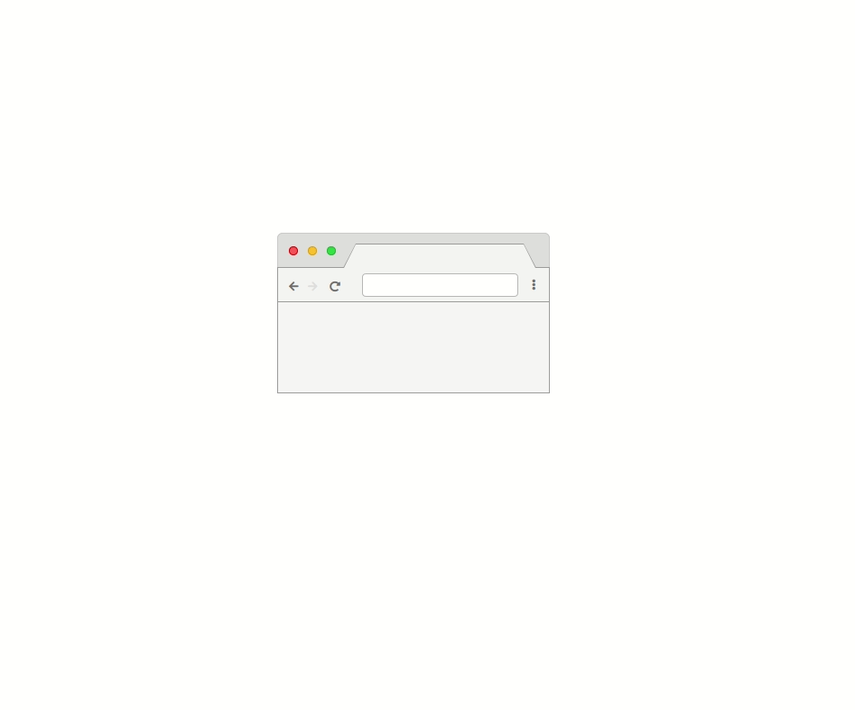

# Mock Up of a Browser window

Mock up of a browser window I wrote for [powerplace.io](//powerplace.io).

Fontawesome is used for the three control icons next to the control bar. Jquery is not required (and was just used for demonstration purposes).
Make sure your html file links to fontawesome and the style file and include the relevant html elements.

